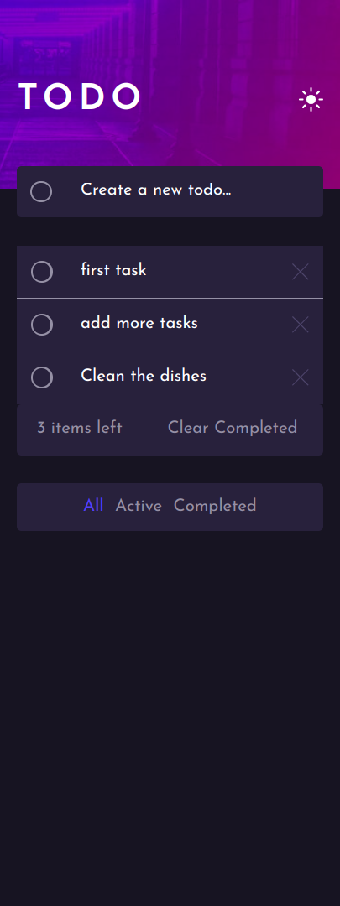
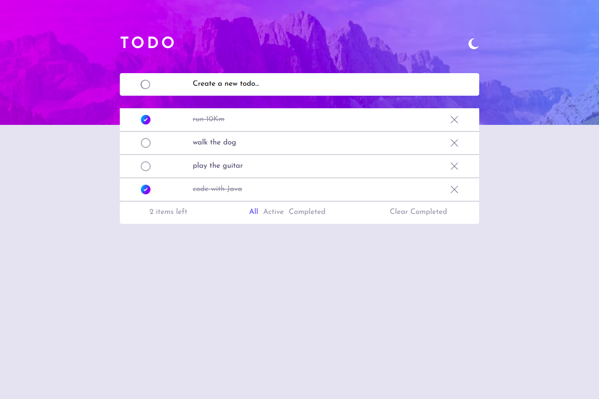

# Frontend Mentor - Todo app solution

This is a solution to the [Todo app challenge on Frontend Mentor](https://www.frontendmentor.io/challenges/todo-app-Su1_KokOW). Frontend Mentor challenges help you improve your coding skills by building realistic projects. 

## Table of contents

- [Frontend Mentor - Todo app solution](#frontend-mentor---todo-app-solution)
  - [Table of contents](#table-of-contents)
  - [Overview](#overview)
    - [The challenge](#the-challenge)
    - [Screenshot](#screenshot)
    - [Links](#links)
  - [My process](#my-process)
    - [Built with](#built-with)
    - [What I learned](#what-i-learned)
    - [Continued development](#continued-development)
  - [Author](#author)

## Overview

### The challenge

Users should be able to:

- View the optimal layout for the app depending on their device's screen size
- See hover states for all interactive elements on the page
- Add new todos to the list
- Mark todos as complete
- Delete todos from the list
- Filter by all/active/complete todos
- Clear all completed todos
- Toggle light and dark mode
- **Bonus**: Drag and drop to reorder items on the list

### Screenshot

### Links

- Live Site URL: [todo-app](https://todo-app-main-one-inky.vercel.app/)

## My process

### Built with

- React Components
- CSS custom properties
- Flexbox
- [React](https://reactjs.org/) - JS library
- [Typescript](https://www.typescriptlang.org/) - For less runtime errors and more reusability
- [redux/toolkit](https://redux-toolkit.js.org/) - For managing states 
- [Styled Components](https://styled-components.com/) - For styles
- [vercel](https://vercel.com/) - For deploying the app

### What I learned

How to use redux/toolkit for controlling an variable state, why an CORB error appeared when trying to get an font.

### Continued development

Using styled-components and redux/toolkit to manage the dark and light mode has a lot of repetition. Create an API to talk with the website so that the tasks are saved in the user profile.

## Author

- email - paulodgsouza@gmail.com
- Linkedin - [@paulodgsouza](https://www.linkedin.com/in/paulodgsouza/)
